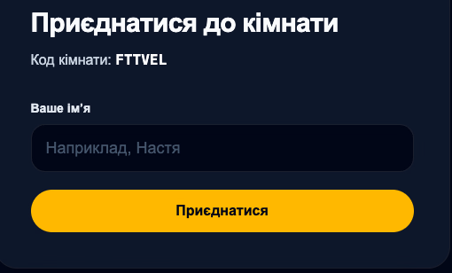

# 012.5 — Simplify the join name field

## Goal

Зробити поле імені в join form коротшим і зрозумілішим: прибрати дублювання видимого label та прикладу імені, залишивши один placeholder «Ваше імʼя».

## Dependencies

- [006 — Join room from phone](006-join-room-from-phone.md): name validation, join form і session restoration.

## Scope / Requirements

- Прибрати видимий label «Ваше імʼя» і placeholder з прикладом конкретного імені.
- Показувати placeholder «Ваше імʼя» у порожньому полі.
- Зберегти programmatic accessible name для input: placeholder не є заміною label для assistive technology.
- Не змінювати Zod validation, trimming, maximum name length, Server Action payload, cookie/session flow або тексти validation errors.
- Перевірити narrow phone, desktop і keyboard/screen-reader semantics.

## Acceptance Criteria

- Видима форма має одне зрозуміле запрошення «Ваше імʼя» в порожньому input без окремого label або прикладу «Наприклад, Настя».
- Input зберігає доступне імʼя для screen reader та коректний focus/keyboard flow.
- Наявні empty, whitespace, oversized і valid name validation scenarios не регресують.
- `pnpm verify` та browser/manual accessibility check проходять.

## Out of Scope

- Зміна room code presentation, join flow, participant roles, form visual system або введення автозаповнення/нових полів.

## Evidence

## References

- Source: hosted verification follow-up, 2026-09-19.
- Sources of truth: `docs/README.md`, active specification, `docs/stack.md`, [006](006-join-room-from-phone.md), and `AGENTS.md`.
