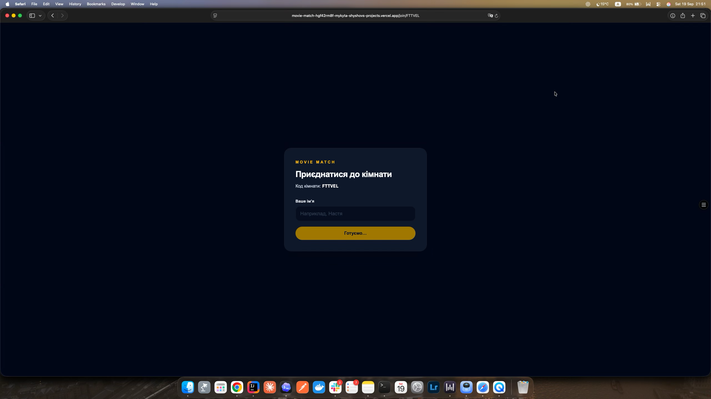

# 012.6 — Clarify join-form readiness

## Goal

Прибрати незрозумілий проміжний стан join form, де новий користувач вже бачить форму, але input і button disabled, а кнопка каже лише «Готуємо…». Користувач повинен або бачити конкретне очікування, або одразу отримувати придатну до введення форму.

## Dependencies

- [006 — Join room from phone](006-join-room-from-phone.md): preparation Server Action, room availability check і join submission.
- [007 — Realtime room participants](007-realtime-room-participants.md): room state після першого participant join.

## Scope / Requirements

- Встановити один зрозумілий readiness contract для нового visitor-а без participant session: до завершення необхідної preparation/check показувати окремий state з конкретним поясненням на кшталт «Перевіряємо кімнату…», а не disabled form із загальним «Готуємо…».
- Після підтвердження доступності кімнати показувати enabled name input і join button без зайвої другої затримки.
- Якщо room стала full, unavailable, closed або expired під час preparation, показувати відповідний existing terminal state, не лишати disabled form.
- Не прибирати runtime validation або server-side availability/credential checks лише заради швидшого UI; не створювати client-side authorization state.
- Перевірити slow network, cancelled/unmounted preparation, retry/error, second participant join і restored participant flow.

## Acceptance Criteria

- New visitor не бачить одночасно join form і неясний disabled «Готуємо…» state.
- Коли form visible як ready, input і button доступні для normal keyboard/touch interaction.
- Під час реальної перевірки користувач бачить конкретний нейтральний loading message; unavailable/full states лишаються точними.
- Preparation не допускає join без existing server-side validation і не створює duplicate participant/session.
- Unit/effect coverage перевіряє ready, loading, failure, unmount і room-state change; browser check перевіряє direct join URL для другого користувача.
- `pnpm verify` і цільові checks проходять.

## Out of Scope

- Зміна join authorization, participant limits, room state machine, cookie format або Realtime protocol.
- Новий onboarding flow, additional form fields чи загальний redesign join page.

## Evidence

## References

- Source: hosted verification follow-up, 2026-09-19.
- Sources of truth: `docs/README.md`, active specification, `docs/stack.md`, [006](006-join-room-from-phone.md), [007](007-realtime-room-participants.md), and `AGENTS.md`.
